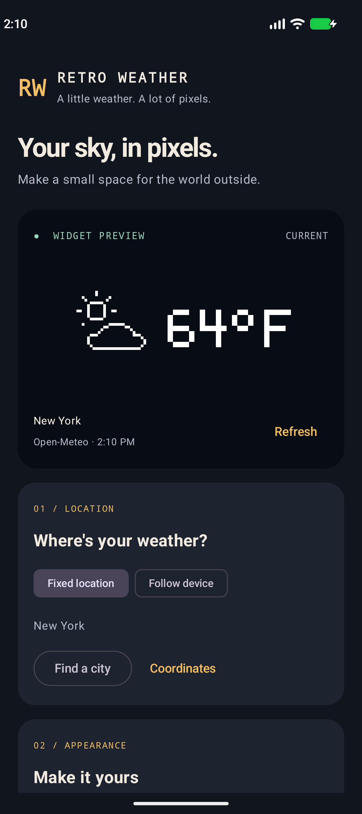
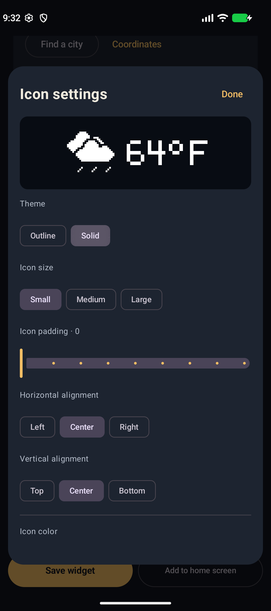

<p align="center">
  
</p>

# Retro Weather

[](https://github.com/adurso0747/Retro-Weather-Widget/actions)
[](app/build.gradle.kts)
[](build.gradle.kts)
[](LICENSE)
[](app/build.gradle.kts)

A native Kotlin Android home-screen widget with original pixel artwork, fixed or device location, free weather data, and a configurable app shortcut.

- Original outline and solid weather icons, with day/night variants.
- Location search, coordinates or device location; current weather updates approximately every 30 minutes.
- Four layouts with independent sizing, padding, alignment, gradients and opacity.
- Transparent backgrounds, contrast outlines and cutout effects.
- Separate settings and app shortcut for each widget.

## Screenshots

Configuration and icon editor, captured from the Android app with sample weather:

<p>
  
  
</p>

## Try it

Build the APK using the instructions below. Once the Android CI workflow has run successfully, its debug APK is available from [GitHub Actions](https://github.com/adurso0747/Retro-Weather-Widget/actions): open the run and download the `retro-weather-debug` artifact.

**App version: 0.1.0** (`versionCode = 1`). See the [changelog](CHANGELOG.md). Build artifacts are debug-signed APKs; no GitHub Release has been published yet.

See [setup](#set-up), [development and tests](CONTRIBUTING.md), [acceptance criteria](docs/ACCEPTANCE.md), [screenshot review](docs/SCREENSHOT_REVIEW.md), and [verification results](docs/VERIFICATION.md).

## Build

| Component | Version |
| --- | --- |
| Kotlin / Compose compiler plugin | 2.2.10 |
| Android Gradle Plugin | 9.4.1, with built-in Kotlin |
| Gradle wrapper | 9.6.0 |
| Compose BOM | 2026.02.01 |
| Compile / target SDK | 37 |
| Minimum Android | 8.0 / API 26 |
| JDK used locally and in CI | 21 |

Kotlin 2.2.10 is confirmed by the resolved Gradle plugin dependency graph. The app's resolved Kotlin standard library and the explicitly configured Compose compiler plugin use the same version.

On the configured Windows machine:

```powershell
$env:JAVA_HOME = 'C:\android-dev\jdk-21'
# local.properties is machine-specific and intentionally ignored by Git:
Set-Content local.properties 'sdk.dir=C\:/android-dev/android-sdk'
.\gradlew.bat assembleDebug testDebugUnitTest lintDebug
```

APK: `app/build/outputs/apk/debug/app-debug.apk`.

With an emulator or USB-debugging device connected:

```powershell
.\gradlew.bat installDebug
.\gradlew.bat connectedDebugAndroidTest
```

The debug APK is signed with the local debug key. A distributable release needs a private release signing key; none is committed or generated by this project.

The default connected suite excludes live-network/Pixel-launcher smoke tests. Run those explicitly using -PliveWeatherTests=true as described in [CONTRIBUTING.md](CONTRIBUTING.md). GitHub Actions builds and runs JVM/lint checks plus emulator tests on API 26 and 35; reports, screenshots and debug APKs are uploaded as workflow artifacts.

## Set up

1. Open **Retro Weather**.
2. Choose a fixed city or coordinates, or enable **Follow device** and grant location permission.
3. Tap **Refresh** to retrieve weather. In dynamic mode, **Find my location** also refreshes it.
4. Select units, icon position, visibility, and outline/solid theme. Open **Icon settings**, **Text settings**, or **Background** for sizes, padding, alignment, colors, gradients, and opacity. **Dimensions** controls overall sizing/alignment; **Special effects** contains outlines and cutout. The initial look is white pixel art on a transparent background.
5. Under **Tap shortcut**, choose a launchable app (for example, your preferred weather app). Clear the selection to open Retro Weather instead.
6. Save and choose **Add to home screen**, or add Retro Weather through the launcher's widget picker.
7. Use the **Your widgets** selector in Retro Weather to edit individual widgets. Each widget has its own location, appearance, and shortcut. Detailed editors change a draft; tap **Save widget** to persist it.

Adding a widget through the launcher opens configuration; canceling does not save a new configuration. App pinning requires confirmation in the launcher. Support for resizing and exact cell dimensions varies by launcher.

### Dynamic location

Android GPS/network location is used without a Google Play Services dependency. Approximate location is accepted. Location is checked periodically, not continuously. To follow movement while the app is closed, grant **Allow all the time** under the app's Android location permissions (Android 10+). The app includes a link and explanation.

If only foreground permission is allowed, weather can still refresh at the last known position, and opening the app refreshes position. Denial, disabled location, and timeouts leave a status message and retain the latest position if available. Fixed locations need no location permissions.

### Providers and limits

- Primary: [Open-Meteo](https://open-meteo.com/), no account/key for non-commercial use. Published limits: 600/minute, 5,000/hour, 10,000/day, 300,000/month. Follow the [terms](https://open-meteo.com/en/terms); limits and availability can change.
- Optional fallback: [WeatherAPI.com](https://www.weatherapi.com/pricing.aspx), currently 100,000 requests/month on its free plan. Create your own free account and enter the key in the app. No working key is bundled.
- Target refresh interval: 30 minutes (48 scheduled weather requests/day/location). WorkManager execution is inexact and Android may delay it.
- Widgets sharing a location share cached weather. Manual refresh has a one-minute cooldown. A failed provider enters a cooldown; HTTP Retry-After is respected. After recovery, the next eligible request uses Open-Meteo again.
- If both providers fail, the widget retains matching-location data. An amber corner dot indicates weather data older than two hours. Missing data uses a setup/refresh message and never fabricates a temperature.
- Fallback city search is supported when a WeatherAPI key exists. Coordinate input works when geocoding is unavailable.

Open-Meteo data are model-based current conditions; switching providers can change reported temperature/condition. Neither free service is an uptime guarantee. See [Open-Meteo pricing](https://open-meteo.com/en/pricing) and [WeatherAPI documentation](https://www.weatherapi.com/docs/).

## Artwork

`art/PixelArt.kt` contains the original hand-authored 32×32 pixel masks and 5×7 temperature glyphs. Each occupied cell is explicitly specified or placed on the grid. There are no downloaded weather icons, image-generation assets, or rasterized vector weather illustrations.

`art/PixelRenderer.kt` draws integer-aligned pixels onto an Android bitmap with antialiasing and bitmap filtering disabled. The preview and RemoteViews widget use the same renderer. The in-app gallery shows all weather families and day/night variants. Instrumented tests export a sprite sheet.

## Widget text and weather descriptions

Choose **Edit widget text** in Appearance to enter up to 160 characters and four lines. The editor previews the result, validates fields, and offers Cancel or Use text; **Save widget** persists the draft for that widget. Existing widgets retain their temperature-only text.

Example:

```text
{temperature:unit}
{condition}
{location}
```

Available fields are `{temperature:unit}`, `{temperature}`, `{unit}`, `{condition}`, `{location}`, `{updated}` and `{date}`. Updated/date refer to the weather observation in the device timezone, using 24-hour time and YYYY-MM-DD. Follow device mode labels the location as “Current location”; fixed mode uses the selected place name. Missing readings use an unavailable marker rather than invented data.

The hand-authored pixel font uses Latin capitals, numbers and common punctuation. Accents are simplified; unsupported characters appear as `?`. Long text wraps and ends with dots when space runs out. **Weather description** adds the condition beneath the icon independently of the main text. Very small widgets may omit the description or icon to retain the main text. Locale overrides and non-Latin font support remain open work.

## Source structure

- `MainActivity.kt`: Compose setup, live preview, location/appearance controls, shortcut app picker, API-key entry, attribution/privacy.
- `AppearanceEditor.kt` and `data/Appearance.kt`: Detailed appearance controls, independent color treatments, and backwards-compatible settings.
- `data/Models.kt`: Provider-neutral weather, condition mappings, widget settings, coordinate validation.
- `data/WeatherApi.kt`: HTTPS transport, bounded responses, response validation, geocoding, provider adapters.
- `data/WeatherRepository.kt`: Request coalescing, cache selection, cooldown and fallback behavior.
- `data/DeviceLocation.kt`: Permission-aware GPS/network fixes, recency checks and timeouts.
- `data/AppStore.kt`: Small atomic SharedPreferences records, bounded recent weather cache, Android Keystore-encrypted fallback key. SharedPreferences is used instead of the initially proposed DataStore so the widget receiver can read a small synchronous snapshot without blocking on coroutines. All app components use the same process.
- `widget/WeatherWidget.kt`: Widget rendering/resizing/configuration lifecycle, pin callback, WorkManager refresh.

## Privacy

No app analytics, advertising, registration, or backend. Latest dynamic position and a bounded recent weather cache are stored privately on-device. Provider requests use coordinates rounded to approximately 1 km; the provider also sees the requesting IP. Search queries go to the geocoding provider. Provider-side logging is governed by their policies.

The optional API key is encrypted with AES-GCM using an Android Keystore key. It is excluded from backup along with the app's other data. It is never logged. The app queries only launchable activities for its shortcut picker, not all installed packages. It requests no continuous foreground location service or exact alarms.

## Release scope and verification

See [acceptance criteria](docs/ACCEPTANCE.md), the [31-screenshot audit](docs/SCREENSHOT_REVIEW.md), and [verification notes](docs/VERIFICATION.md). Full screenshot feature parity is incomplete. Gradients, solid icons, opacity, independent sizing/alignment, outlines, cutout, editable current-weather text, visible condition descriptions and per-widget app shortcuts are implemented. Open work includes forecasts, locale/timezone selection, full unit presets, background scenes, animation, global overlays, gradient presets and recent colors. The audit records smaller control and validation gaps as well. App-specific deep links were not demonstrated in the screenshots and remain outside the original release scope.

Data attribution: Open-Meteo, [CC BY 4.0](https://creativecommons.org/licenses/by/4.0/). Temperatures are rounded and condition codes mapped to original artwork. Optional fallback data by WeatherAPI.com. Third-party software remains under its respective licenses.

## Contributing and issues

Read [CONTRIBUTING.md](CONTRIBUTING.md) for development setup, test commands and review expectations. Report bugs or request features through [GitHub Issues](https://github.com/adurso0747/Retro-Weather-Widget/issues). For widget issues, include Android version, launcher, reproduction steps and a screenshot; omit API keys and private coordinates.

## License

Source code and original artwork are available under the [MIT License](LICENSE). Copyright © 2026 Retro Weather contributors. Weather data and third-party dependencies retain their own licenses and service terms; the MIT license does not replace those terms.
